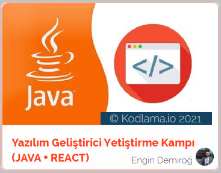

# JavaReactCamp
 &copy;[2021 Kodlama.io](https://www.kodlama.io/) da Java + React Eðitim Kampý Çalýþmalarý

### JAVA Temelleri 1
* [Kurs 1 - Giriþ](/intro/src/intro)
  * [Ödev #1](/homeTask1/src/mukemmelSayi)

### JAVA Temelleri 2
* [Kurs 2 - oopIntro](/oopIntro/src/oopIntro)
  * [Ödev #1](/homeTask2/src/kodlamaIo)
  * [Ödev #2](/homeTask2/src)

### JAVA ile Nesne Yönelimli Programlamaya Giriþ
* [Kurs 3 - inheritance](/inheritance/src/inheritance),  [inheritance2](/inheritance2/src/inheritance2)
  * [Ödev #1](/homeTask3/src)
  * [Ödev #2](/homeTask3/src/kodlamaIo)

### JAVA ile Nesne Yönelimli Programlamada Uzmanlaþma-1
* [Kurs 4 - interfaces](/interfaces/src/interfaces)
  * [Ödev #1](/homeTask4/src)
  * [Ödev #2](/homeTask4plus/src/interfaceAbstractDemo)
  * [Ödev #3](/homeTask4plus/src/newestGamersCo)

### JAVA ile Nesne Yönelimli Programlamada Uzmanlaþma-2 
* [Kurs 5 - nLayeredDemo](/nLayeredDemo/src/nLayeredDemo)
  * [Ödev #1](/homeTask5/src/eTrade)

### Çok Katmanlý Kurumsal Mimariler
* [Kurs 6 - northwind](/northwind/src/main/java/kodlamaio/northwind)
  * [Ödev #2](/hrms/src/main/resources/hrms_schema_script)
  * [Ödev #3](/hrms/src/main/java/kodlama/ht6/hrms)
  
### Spring Boot ile çalýþmaya baþlamak
* [Kurs 7 - northwind](/northwind/src/main/java/kodlamaio/northwind)
  * [Ödev #1](/hrms/src/main/java/kodlama/ht6/hrms)
  * [Ödev #3](/hrms/src/main/java/kodlama/ht6/hrms) ~ [Güncellenmiþ Kaynaklar](/hrms/src/main/resources/hrms_schema_script)
  
### Spring JPA/Hibernate
* [Kurs 8 - northwind ~ Güncellemeler..](/northwind/src/main/java/kodlamaio/northwind)
  * [Ödev #1 ~ Güncellemeler..](/hrms/src/main/java/kodlama/ht6/hrms)
  
### Spring AOP
* [Kurs 9 - northwind ~ Güncellemeler..](/northwind/src/main/java/kodlamaio/northwind)
  * [Ödev #1 ~ Güncellemeler..](/hrms/src/main/java/kodlama/ht6/hrms)
  * [Ödev #2 ve Kaynak ~ Güncellemeleri..](/hrms/src/main/java/kodlama/ht6/hrms)